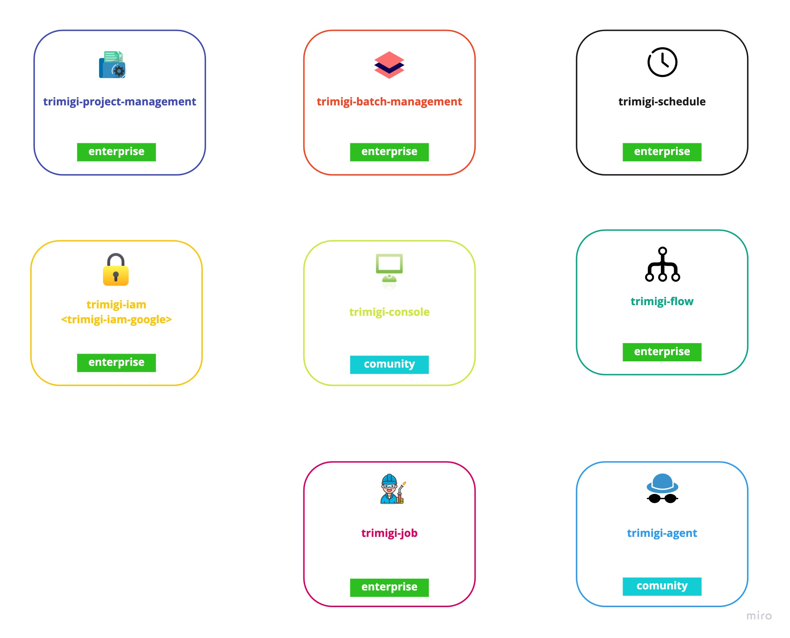

# trimigi
Trimigi documentation, architecture and API centralised repository

## Trimigi overview

## Trimigi platform components

| Component name                                                      | Type        | Deployment                     | Managed by  | Production ready |
|---------------------------------------------------------------------| ----------- |--------------------------------| ----------- | ---------------- |
| [trimigi-console](#component-trimigi-console)                       | UI          | GCloud SaaS                    | Turnonline  | &#9989;          |
| [trimigi-job](#component-trimigi-job)                               | service     | GCloud SaaS                    | Turnonline  | &#10060;         | 
| [trimigi-project-management](#component-trimigi-project-management) | service     | GCloud SaaS                    | Turnonline  | &#10060;         | 
| [trimigi-batch-management](#component-trimigi-batch-management)     | service     | GCloud SaaS                    | Turnonline  | &#10060;         | 
| [trimigi-schedule](#component-trimigi-schedule)                     | service     | GCloud SaaS                    | Turnonline  | &#10060;         |
| [trimigi-flow](#component-trimigi-flow)                             | service     | GCloud SaaS                    | Turnonline  | &#10060;         |
| [trimigi-agent](#component-trimigi-agent)                           | service     | AppEngine/Cloud run/On premise | Client      | &#9989;          | 
| [trimigi-iam](#component-trimigi-iam)                               | service     | GCloud SaaS                    | Client      | &#10060;         | 

### Component `trimigi-console`
Centralized UI console for:
* management of migrations/imports
* scheduling of migrations/imports
* management of projects

### Component `trimigi-job`
Service for:
* management of jobs created by migration batch
* management of jobs created by import batch

### Component `trimigi-project-management`
Service for:
* management of projects
* adding users to projects

### Component `trimigi-batch-management`
Service for:
* management of migration batches
* management of import batches

### Component `trimigi-schedule`
Service for:
* scheduling of migrations
* scheduling of imports
* scheduling of flows

### Component `trimigi-flow`
Service for:
* designing of workflow for complex task (run migration A, run migration B, initialize import with codebook, etc.)
* support for parallel, sequence or conditional execution of tasks

### Component `trimigi-agent`
Concrete implementation of agent
* sql
* datastore
* mongo
* elasticsearch

### Component `trimigi-iam`
Service for:
* authorization of Trimigi services
